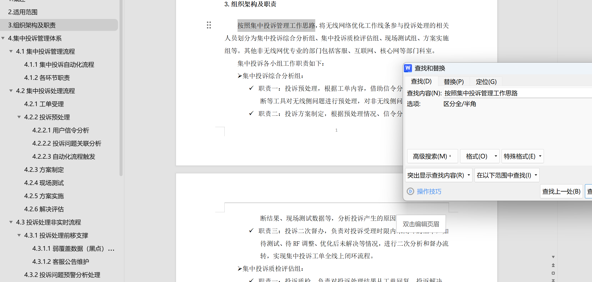
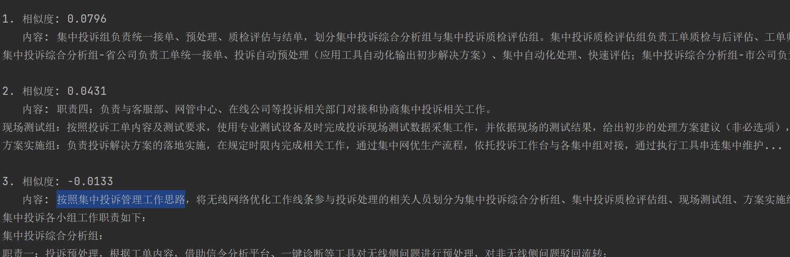
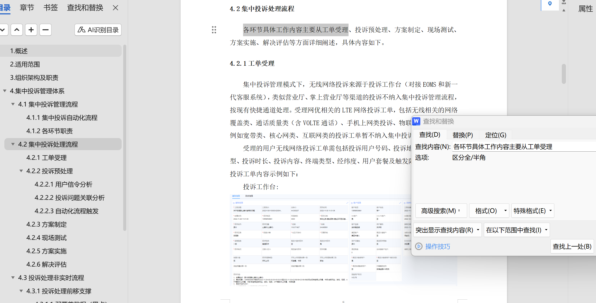
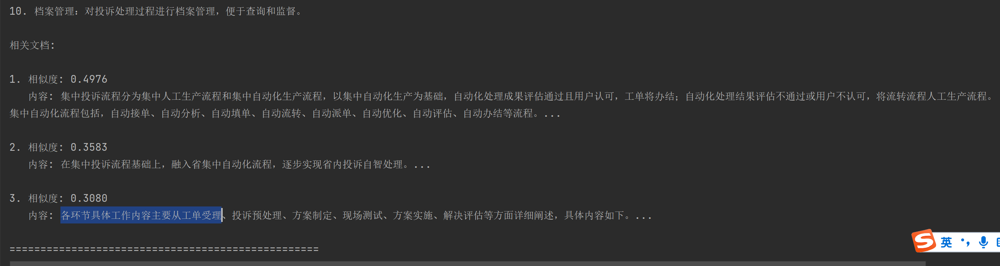
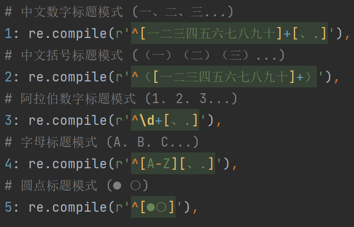

+++
date = '2024-12-11T17:33:00+08:00'
draft = true
title = '报告分析'
+++
# 当前问题：文本块检索到的信息包含上下文信息过少，大模型可依据的文本块信息不足，回答效果不好。

**对比一共三种存储向量方式：**
分为：
原始存储方式（直接1024切割，设定一定重叠次数）
基于标题切分存储（按层级结构（例如二级标题切分，根据文本块大小再细切处理））
基于层级结构，构建元数据（按照层级结构编写元数据结构格式，确保返回给模型足够完善信息）

**根据对比发现：**
1024在面对层级结构文档时，询问问题返回的文本块信息与答案基本不相关。
根据标题切分返回的文本块信息能够检索到，但有时也会不够全面，在复杂层级结构下也会效果不好（比如虽然检索到了，但可能遗漏重要信息）。
元数据在当前测试中，表现最好，检索到了真正问题想要返回的对应文本块信息，但比较构建依赖数据质量，数据杂乱构建工作会很困难。

# 原始切割方法：

集中投诉管理流程是什么？

组织架构及职责有哪些？

集中投诉处理流程有哪些？

# 二级标题切分方法：

集中投诉管理流程是什么？

组织架构及职责有哪些？

集中投诉处理流程有哪些？

# 元数据处理方法：

集中投诉管理流程是什么？

组织架构及职责有哪些？

集中投诉处理流程有哪些？

直接1024切分：
将整篇文档按固定长度等分切片，不考虑文档内部的标题、层次结构或逻辑分段。
优点：
简单易行，实施成本低。
切分过程不需要预解析文档结构。
缺点：
语义连续性可能被破坏。例如一节内容被切为上下两个块，查找上下文不便。
检索结果可能包含过多无关信息，因为每块内容上下文边界不清晰。
难以利用文档自带的层级信息，导致检索精度下降。

二级标题切分：
在解析文档后，以二级标题为基本单元，将每个二级标题及其对应的正文内容作为独立文本块。若块过长，可在二级标题下进一步按自然段落拆分，但仍保持上下文的逻辑连续性。
优点：
能够保留文档的层次结构，增强检索结果的可解释性和关联性。
每个文本块对应文档中的一个明确逻辑段落（如一个二级子主题），便于在检索时聚焦更相关的语义单元。
上下文相对清晰，可以减少无关内容混入。 缺点：
需要对文档进行结构化解析与预处理，对文档格式要求较高。
如果文档格式不规范（无清晰的二级标题），则此方法的效果会较差。

构建元数据：
可解释性强，如果元数据包括作者、版本、日期、主题字段，用户可快速理解检索结果的来源和上下文。但需要持续维护元数据和相关体系。

灵活性与扩展性：
固定长度切分：缺乏灵活性，对文档结构和扩展性支持有限。
二级标题切分：相对灵活，可根据文档结构轻松扩展，对多级标题层次也有一定适应性。
元数据驱动切分：最灵活，可根据多维度进行检索扩展，对多文档、多格式场景适用性高。

总结：
固定长度切分适用于快速原型、简单场景，实现简单，但在精度与可解释性上表现一般。
基于二级标题的切分非常适合有清晰结构的文档，可在较低的实现成本下获得更高的检索相关性和可解释性，需要对文档解析抽取标题结构，但如果格式不一需要耗费大量时间针对不同结构进行对应处理，并不适合处理大量数据时使用。
元数据的切分与检索在有丰富、可靠元数据的场景下表现最佳，可实现高精度、高可扩展的检索，需要额外的数据治理、元数据标注、索引策略和查询规划，实施成本和复杂度最高，在实现好的效果的同时需要更多的前期投入时间和持续维护。（目前元数据构建支持的数据形式：内置word标题格式：heading以及正则格式）

